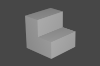
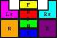
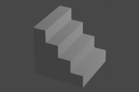
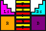
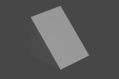
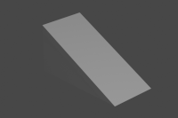
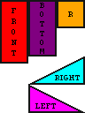

## Simple Models

---
### Description

A set of very simple models for [Minetest](https://www.minetest.net/) & API for handling them.


---
### Usage

#### Models

simple_models_cube_1x2x1:
- for nodes with dimensions 1x2x1

- preview:

  

- texture map:

  

simple_models_panel_1x2x1:
- for door or panel-like nodes with dimensions 1x2x1

- preview:

  

- texture map:

  

simple_models_panel_mid_1x2x1:
- for door or panel-like nodes with dimensions 1x2x1 positioned in center
- texture map: same as simple_models_panel_1x2x1

simple_models_panel_rear_1x2x1:
- for door or panel-like nodes with dimensions 1x2x1 positioned at rear
- texture map: same as simple_models_panel_1x2x1

simple_models_stair_1x1x1:
- for stair-like nodes with dimensions 1x1x1

- preview:

  

- texture map:

  

simple_models_stair_fine_1x1x1:
  - for stair-like nodes with dimensions 1x1x1

  - preview:

    

  - texture map:

    

simple_models_slope_1x1x1:
  - for slope-like nodes with dimensions 1x1x1

  - preview:

    

  - texture map:

    

simple_models_slope_1x1x2:
  - for slope-like nodes with dimensions 1x1x2

  - preview:

    

  - texture map:

    

#### Tables

There are some tables for accessing pre-defined attributes:

```
simple_models.cube_1x2x1:
- fields:
  - mesh: "simple_models_cube_1x2x1.obj"
  - box:  {-0.5, -0.5, -0.5, 0.5, 1.5, 0.5}
- alias: simple_models.cube

simple_models.panel_1x2x1:
- fields:
  - mesh: "simple_models_panel_1x2x1.obj"
  - box:  {-0.5, -0.5, -0.5, 0.5, 1.5, -0.45}
- alias: simple_models.panel

simple_models.panel_mid_1x2x1:
- fields:
  - mesh: "simple_models_panel_mid_1x2x1.obj"
  - box:  {-0.5, -0.5, 0.025, 0.5, 1.5, -0.025}
- alias: simple_models.panel_mid

simple_models.panel_rear_1x2x1:
- fields:
  - mesh: "simple_models_panel_rear_1x2x1.obj"
  - box:  {-0.5, -0.5, 0.45, 0.5, 1.5, 0.5}
- alias: simple_models.panel_rear

simple_models.stair_1x1x1:
- fields:
  - mesh: "simple_models_stair_1x1x1.obj"
  - box:  {{-0.5, 0.0, 0.0, 0.5, 0.5, 0.5}, {-0.5, -0.5, -0.5, 0.5, 0.0, 0.5}}
- alias: simple_models.stair

simple_models.stair_fine_1x1x1x:
- fields:
  - mesh: "simple_models_stair_fine_1x1x1x.obj"
  - box:  {
      {-0.5,  0.25,  0.25, 0.5,  0.5,  0.5},
      {-0.5,  0.0,   0.0,  0.5,  0.25, 0.5},
      {-0.5, -0.25, -0.25, 0.5,  0.0,  0.5},
      {-0.5, -0.5,  -0.5,  0.5, -0.25, 0.5},
    }
- alias: simple_models.stair_fine

simple_models.slope_1x1x1:
- fields:
  - mesh: "simple_models_slope_1x1x1.obj"
  - box:  {
      {-0.5, -0.5,  0.4, 0.5,  0.5, 0.5},
      {-0.5, -0.5,  0.3, 0.5,  0.4, 0.5},
      {-0.5, -0.5,  0.2, 0.5,  0.3, 0.5},
      {-0.5, -0.5,  0.1, 0.5,  0.2, 0.5},
      {-0.5, -0.5,  0.0, 0.5,  0.1, 0.5},
      {-0.5, -0.5, -0.1, 0.5,  0.0, 0.5},
      {-0.5, -0.5, -0.2, 0.5, -0.1, 0.5},
      {-0.5, -0.5, -0.3, 0.5, -0.2, 0.5},
      {-0.5, -0.5, -0.4, 0.5, -0.3, 0.5},
      {-0.5, -0.5, -0.5, 0.5, -0.4, 0.5},
    }
- alias: simple_models.slope

simple_models.slope_1x1x2:
- fields:
  - mesh: "simple_models_slope_1x1x2.obj"
  - box:  {
      {-0.5, -0.5,  0.3, 0.5,  0.5, 0.5},
      {-0.5, -0.5,  0.1, 0.5,  0.4, 0.5},
      {-0.5, -0.5, -0.1, 0.5,  0.3, 0.5},
      {-0.5, -0.5, -0.3, 0.5,  0.2, 0.5},
      {-0.5, -0.5, -0.5, 0.5,  0.1, 0.5},
      {-0.5, -0.5, -0.7, 0.5,  0.0, 0.5},
      {-0.5, -0.5, -0.9, 0.5, -0.1, 0.5},
      {-0.5, -0.5, -1.1, 0.5, -0.2, 0.5},
      {-0.5, -0.5, -1.3, 0.5, -0.3, 0.5},
      {-0.5, -0.5, -1.5, 0.5, -0.4, 0.5},
    }
- alias: simple_models.slope_long
```

#### Helper Methods

There are some helper methods to make opening & closing door-like nodes simpler. They take the parameters `pos`, `new_node`, & `invert`. If `invert` is set to `true`, doors will swing in the opposite direction:

```
simple_models:door_inward_open
- Helper method for inward opening door-like nodes.

simple_models:door_inward_close
- Helper method for inward closing door-like nodes.

simple_models.door_outward_open
- Helper method for outward opening door-like nodes.

simple_models.door_outward_close
- Helper method for outward closing door-like nodes.
```

Example usage:
```lua
core.register_node("simple_models:door_l_closed", {
  on_rightclick = function(pos, node, clicker, stack, pointed_thing)
    simple_models:door_inward_open(pos, "simple_models:door_l_open")
    return stack
  end,
})

core.register_node("simple_models:door_r_closed", {
  on_rightclick = function(pos, node, clicker, stack, pointed_thing)
    simple_models:door_inward_open(pos, "simple_models:door_r_open", true)
    return stack
  end,
})
```

---
### Samples

To use sample nodes, enable the setting `simple_models.enable_samples`.

Sample nodes include:
- simple_models:node_tall
- simple_models:panel
- simple_models:panel_mid
- simple_models:panel_rear
- simple_models:door_l_in_closed
- simple_models:door_l_in_open
- simple_models:door_l_out_closed
- simple_models:door_l_out_open

---
### Licensing

- Code: [MIT](LICENSE.txt)
- Models & Textures: [Creative Commons Zero (CC0) 1.0](https://creativecommons.org/publicdomain/zero/1.0/)

---
### Links

- [](https://content.minetest.net/packages/AntumDeluge/simple_models/)
- [Forum](https://forum.minetest.net/viewtopic.php?t=27176)
- [Git repo](https://github.com/AntumMT/mod-simple_models)
